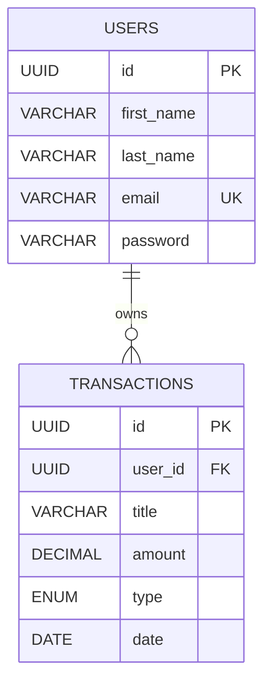

# Banco de Dados

## Modelo Entidade-Relacionamento

---

## Relacionamentos

Um usuário pode possuir diversas transações.

Cada transação pertence a apenas um usuário.

---

## Índices

- PK(id)
- UNIQUE(email)
- INDEX(user_id)
